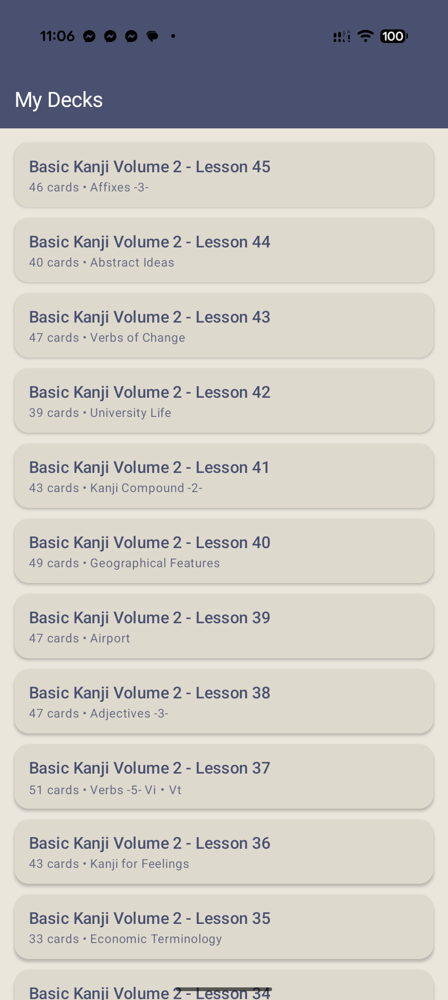
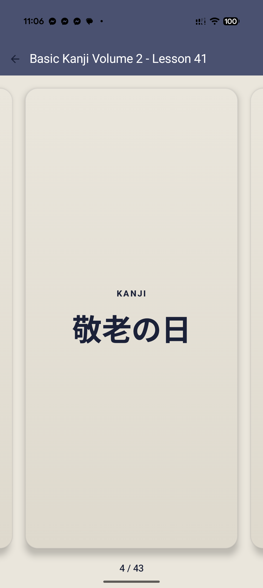
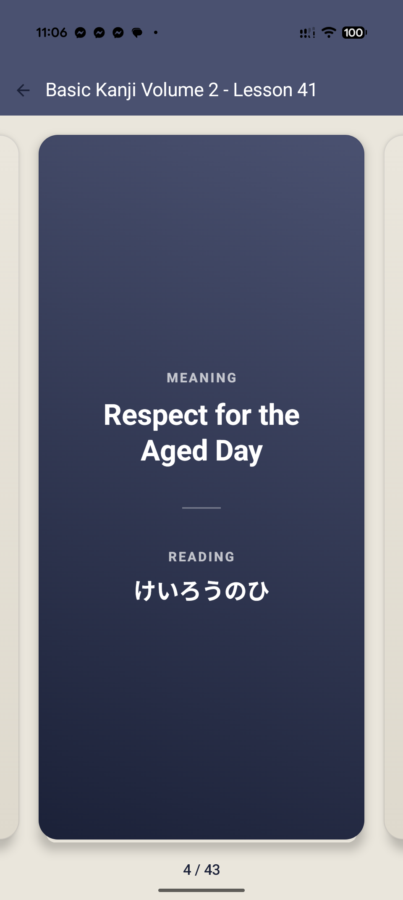
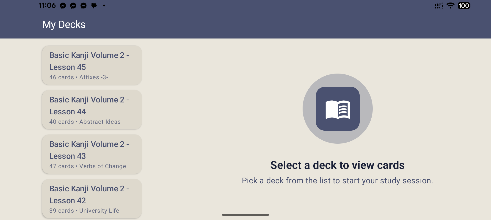
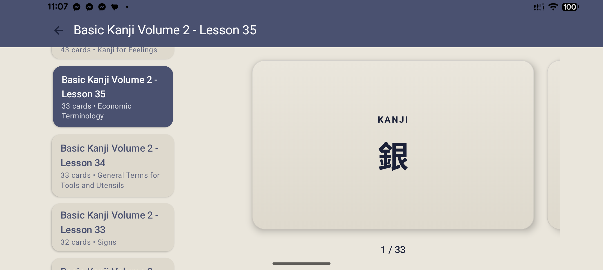
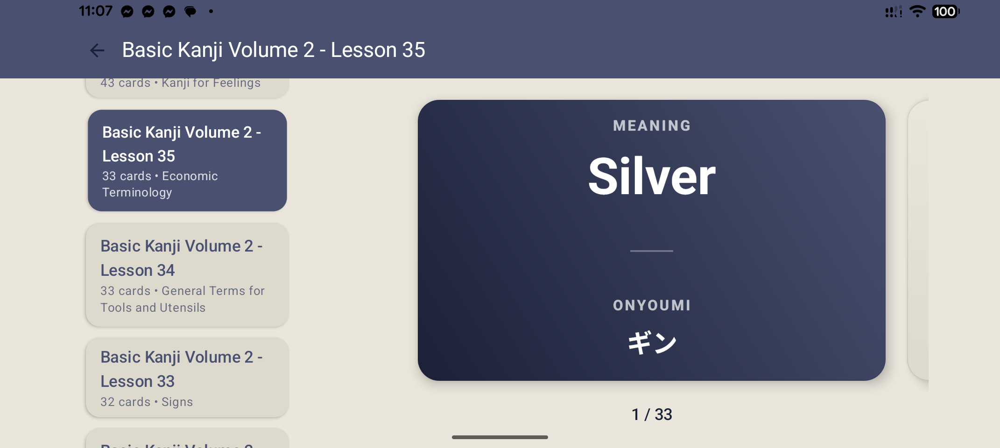

# Flashcards - Custom Study Cards

## Project Overview
A dedicated Android application designed to assist in memorizing Kanji and Japanese vocabulary. This is a personal project I created to support my own journey of learning Japanese.

## Core Features
- **Adaptive Layout**: Implements a list-detail scaffold that optimizes the UI for phones, tablets, and foldables.
- **Engaging Study Flow**: Interactive flashcards with 3D flip animations to reveal meanings and readings.
- **Offline Reliability**: Full local persistence using Room database, ensuring all study progress is saved and available without an internet connection.
- **Hardware Optimized**: Custom handling of safe areas (such as notches and system bars) to ensure content is always visible while background colors bleed to the physical edges.

## Technical Stack
- **Jetpack Compose**: Declarative UI with Material 3 components.
- **Material 3 Adaptive**: Multi-pane layout orchestration.
- **Architecture**: MVVM pattern using StateFlow and Navigation 3.
- **Room Persistence**: Local SQLite storage for decks and cards.
- **Hilt**: Dependency injection for clean component management.
- **Kotlin 2.4 / AGP 9.3**: Built with the latest Android toolchain.

## Screenshots

### Portrait Mode

  
  
  

### Landscape Mode

  

  

  

